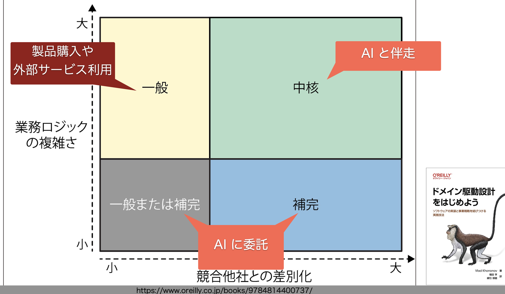

<!-- _backgroundColor: #1a202c -->
<!-- _color: #e2e8f0 -->
<!-- _paginate: false -->

<style scoped>
section {
  text-align: center;
  display: flex;
  flex-direction: column;
  justify-content: center;
  position: relative;
}

h1 {
  font-size: 4em;
  border: none;
  margin-bottom: 80px;
  color: #ffffff;
  font-weight: 800;
  letter-spacing: -0.02em;
}

p {
  font-size: 1em;
  color: #94a3b8;
  margin: 5px 0;
}

.bottom-info {
  position: absolute;
  bottom: 60px;
  left: 0;
  right: 0;
  text-align: center;
}

.event-name {
  font-size: 1.2em;
  color: #60a5fa;
  margin-top: 20px;
  font-weight: 600;
}

.ruby {
  font-size: 0.4em;
  position: absolute;
  top: -1em;
  left: 50%;
  transform: translateX(-50%);
  color: #cbd5e0;
  font-weight: 400;
}
</style>

# 誰のための<span class="ruby-text">設計<span class="ruby">design</span></span>？

<div class="bottom-info">
<p>July 25, 2025</p>
<p>Takeshi Yonekubo</p>
<p class="event-name">設計ナイト2025</p>
</div>

---

# 自己紹介

- **米久保 剛** (@tyonekubo)
- 設計大好き

<div class="book-gallery">
  <div class="book-item">
    
    <p class="book-caption">発売一周年！</p>
  </div>
  <div class="book-item">
    
    <p class="book-caption">韓国語版も！</p>
  </div>
  <div class="book-item">
    
    <p class="book-caption">リファクタリング特集に寄稿</p>
  </div>
</div>

---

# タイトルの元ネタ

## 『誰のためのデザイン？ 認知科学者のデザイン言論』
- D.A.ノーマン博士の著書


---

# HCD（Human-Centered Design）

## 人間中心設計

- 人間のニーズ、能力、行動に合わせてデザインする
- ユーザーの視点から道具を設計する

---

# 7つのデザイン原理

1. **概念モデル**
2. **発見可能性**
3. **アフォーダンス**
4. **シグニファイア**
5. **制約**
6. **対応づけ**
7. **フィードバック**

---

# 概念モデル

- 道具のメカニズムや基本動作原理に対する、ユーザーの心の中にあるモデル（**メンタルモデル**）
- ユーザーが良い概念モデルを形成できるように、道具の設計を行う

<div class="image-container">
  
  <p class="image-caption">出典『誰のためのデザイン?』図1・11</p>
</div>

---

# 発見可能性

## 道具の使い方を見出し、理解することが容易であること

- 道具を見ただけで「何ができるか」「どう使うか」が分かる
- 試行錯誤なしに正しい使い方を発見できる
- **統合的な原理**: 他の5つの原理が協調して実現

<div class="highlight-box">

発見可能性 = 
アフォーダンス + シグニファイア + 制約 + 対応づけ + フィードバック

</div>

---

# アフォーダンス

## 環境が提供する行為の可能性

**定義**: モノと主体（人、動物、ロボット）との関係性の中で生まれる、行為の可能性

**例: イスは...**
- 座ることを可能にする（afford sitting）
- 支えを提供する（afford support）
- 持ち上げることを可能にする（afford lifting）


---

# シグニファイア

## アフォーダンスの存在を示す手がかり
- マークや音など知覚可能なもの

**例: ティーバッグのタグ**


---

# 制約

## 物理的、論理的、意味的、文化的な制約によって、取りうる行動を制限する

- エラーを防ぐデザイン
- ポカよけ
**例: 乾電池ホルダーのバネ（マイナス端子）**


---

# 対応づけ（マッピング）

## 要素同士の関係が明確であること

**例: ファミコンのコントローラー（十字キー）**


---

# フィードバック

## ユーザーの意図に対して、システムが働いていること/働いていないことを知らせる

- 行為の結果を伝える
- ユーザーに安心感を与える


---

# デザイン原理の適用

## 物理的な道具から、デジタルな道具へ

- ノーマン博士のデザイン原理は**あらゆる道具**に適用可能
- ソフトウェアという道具の利用者にはプログラマも含まれる
- 使う人（プログラマ）の認知や行動を考慮した設計が重要

---

# プログラマの道具

- プログラミング言語
- IDE
- ライブラリ
- ターミナル、コマンド
- 生成AI
- **ソフトウェアそのもの**: 自分が書いたコンポーネントは、自分や他のプログラマが使う道具

---

# プログラマのための道具をデザインする

## ノーマン博士の7つのデザイン原理を適用可能


---

# サンプルコード: 売上レポート集計プログラム

<div class="two-column">

```kotlin
fun generateSalesReportLegacy(salesData: List<SalesRecord>): String {
    val output = StringBuilder()
    var currentDept = ""
    var currentMonth = ""
    var deptTotal = 0.0
    var monthTotal = 0.0
    var monthQuantity = 0
    var grandTotal = 0.0
    var isFirst = true
    
    val sortedData = salesData.sortedWith(
        compareBy({ it.dept }, { it.month }, { it.date })
    )
    
    for (record in sortedData) {
        // 部門ブレイク
        if (currentDept != record.dept) {
            if (!isFirst) {
                output.append("  部門計: ${formatCurrency(deptTotal)}\n\n")
                deptTotal = 0.0
            }
            currentDept = record.dept
            output.append("【${currentDept}】\n")
            currentMonth = ""
        }
        // 月ブレイク処理、詳細行出力、累計更新...
    }
    // 最終集計処理...
}
```

<pre class="output-box">
【営業部】
  ▼ 2024年4月
    2024-04-01: 120,000円
    2024-04-15:  85,000円
    月計: 205,000円
  ▼ 2024年5月
    2024-05-02: 156,000円
    月計: 156,000円
  部門計: 361,000円

【開発部】
  ▼ 2024年4月
    2024-04-10:  98,000円
    月計:  98,000円
  ...
</pre>

</div>

<p style="margin-top: 20px; text-align: center;">
  <a href="https://github.com/yonetty/design_principle_dsl" class="repo-link">
    📦 https://github.com/yonetty/design_principle_dsl
  </a>
</p>

---

# コントロールブレイク処理

## 特定の条件を満たす間、データに対して反復処理を行う
## 条件が変わったら、集計や出力等の処理を行う

- 例: 月ごと、部門ごとの売上集計
- 古典的な**アルゴリズムのパターン**
- キー項目の変化をトリガーに集計処理を行う

---

# 既存コードの問題点

<div class="highlight-box warning">

**1. 高い認知負荷**: 多くの状態変数を追跡する必要がある

**2. バグの温床**: リセット忘れ、最終集計の漏れが発生しやすい

**3. 低い可読性**: ネストが深く、処理の流れが追いにくい

**4. 拡張困難**: 新しい階層を追加する際の影響範囲が広い

</div>

---

# デザイン原理の適用：<span class="subtitle">概念モデル / 対応づけ</span>

## 「コントロールブレイク」の基本メカニズム

- キー項目のブレイクをきっかけに集計などの処理を行う

 <b>→概念モデルとコードが対応づく形で記述できるようにしたい</b>
 <b>→どうやって？</b>

---

# コードサンプル: <span class="subtitle">DSLによる概念モデルとの対応づけ</span>

```kotlin
salesData.applyControlBreak {
    // レベル1: 部門
    breakOn { it.dept }
        .onStart { dept -> 
            println("\n【 $dept 】")
        }
        .memo({ doubleAccumulator() }) { record -> 
            this += record.amount 
        }
        .onEnd { dept, total: Accumulator<Double>? -> 
            println("部門売上合計: ${formatCurrency(total?.value)}") 
        }
        .register()
    // レベル2: 月
    breakOn { it.month }
        .onStart { month -> 
            println(" ▼ $month") 
        }
        .memo({ MonthlyStats() }) { record ->
            update(record.amount, record.quantity)
        } // (以下略)

```

---

# デザイン原理の適用：<span class="subtitle">アフォーダンス / シグニファイア</span>

## 標準のListのアフォーダンス
- 要素を格納できる、要素にアクセスできる、etc

## 新しいアフォーダンスの追加
- 「コントロールブレイク処理を適用できる」
- Kotlinの拡張関数によりアフォーダンスをListに追加

---

# コードサンプル: <span class="subtitle">拡張関数</span>

```kotlin
// List<T>型に新しいメソッドを追加
fun <T> List<T>.applyControlBreak(block: ControlBreakDSL<T>.() -> Unit) {
    val dsl = ControlBreakDSL<T>()
    dsl.block()
    val processor = dsl.build()
    processor.process(this)
}

// 使用側のファイルでインポート
import com.example.controlbreak.applyControlBreak

fun generateReport(salesData: List<SalesRecord>) {
    // 通常のListメソッドのように自然に呼び出せる
    salesData.applyControlBreak {
        // DSLによる直感的な記述
    }
}
```

---

# デザイン原理の適用：<span class="subtitle">制約によるポカよけ</span>

## 型システムによるガード

- コンパイル時のエラー検出
- 不正な使用を防ぐ

---

# コードサンプル: <span class="subtitle">型システムの活用</span>

```kotlin
// memoの初期化ラムダがAccumulator<Double>を返すので、
// 更新ラムダ内のthisもAccumulator<Double>型となる
.memo({ doubleAccumulator() }) { record ->
    this += record.amount    // OK: Double型の加算
    // this += record.dept   // コンパイルエラー: String型は加算できない
}

// カスタム型でも同様に型安全
// DetailedStats型を返すので、thisもDetailedStats型
.memo({ DetailedStats() }) { record ->
    // DetailedStatsのメソッドが呼び出せる
    add(record.amount, record.quantity)
    updateMedian(record.amount)
}
```

---

# デザイン原理の適用：<span class="subtitle">フィードバック</span>

## 早期エラーによるフィードバック

- エラー詳細情報
- 問題の迅速な特定と修正

---

# コードサンプル: <span class="subtitle">エラー処理</span>

```kotlin
// ミス: データがソートされていない（キーでソートされていることが事前条件）
val unsortedData = listOf(
    SalesRecord("営業部", "4月", 100_000), SalesRecord("開発部", "4月", 200_000),
    SalesRecord("営業部", "5月", 150_000)  // エラー: 営業部が再び出現
)
unsortedData.applyControlBreak { breakOn { it.dept }.register() } // 処理実行
/* 実行時にわかりやすいエラーメッセージでフィードバック
ControlBreakException: データが正しくソートされていません
Context:
  level: 0 (部門)
  recordIndex: 2
  previousKey: "開発部"
  currentKey: "営業部"
  record: SalesRecord(dept="営業部", month="5月", amount=150000)
提案: データを事前にソートしてください
  someData.sortedBy { it.field }
*/
```

<div class="highlight-box success">

**フィードバックの効果**: 
- エラーの原因と発生位置が明確
- 問題のあるデータの詳細を表示
- 具体的な修正方法を提案

</div>

---

# デザイン原理の適用：<span class="subtitle">発見可能性</span>

## テストコードで使い方を具体的に示す

- 実例による学習
- ドキュメントとしての役割

---

# コードサンプル: <span class="subtitle">テストコード</span>

```kotlin
@Test
fun `should process simple control break correctly`() {
    // Given
    val data = listOf(TestRecord("A", 100), TestRecord("A", 200), TestRecord("B", 300))
    var result = ""
    // When
    data.applyControlBreak {
        breakOn { it.group }
            .onStart { group -> result += "Start:$group," }
            .memo({ intAccumulator() }) { record -> 
                this += record.value 
            }
            .onEnd { group, total: Accumulator<Int>? -> 
                result += "End:$group=${total?.value}," 
            }
            .register()
    }
    // Then
    assertEquals("Start:A,End:A=300,Start:B,End:B=300,", result)
}
```

---

# DSL（ドメイン固有言語）

## ユーザーの認知負荷を減らし、本質的な課題に集中することができる

- より表現力豊かなコードを実現
- ただし、DSLの実装難易度や工数が課題
- オーバーエンジニアリングのリスク

---
# AIを活用した開発者体験向上

## これまでは費用対効果で難しかったDSLの実装が、生成AIによって容易に

<div class="highlight-box success">

**富豪プログラミング** - リソースを贅沢に使って理想的な設計を実現

**開発者体験の大幅な向上** - 直感的で使いやすいAPIの提供

</div>

<b>→オーバーエンジニアリングが正当化される時代</b>

---

# AIとの伴走

## コアドメイン（中核）：AIを使いこなすクリエイティビティが重要

<div class="image-container" style="margin-bottom: 0;">
  
  <p class="image-caption" style="margin-bottom: 5px;">出典: t-wada『AI時代のソフトウェア開発を考える』</p>
  <a href="https://speakerdeck.com/twada/agentic-software-engineering-findy-2025-07-edition" target="_blank" style="color: #4299e1; text-decoration: none; font-size: 0.75em; display: block;">
    https://speakerdeck.com/twada/agentic-software-engineering-findy-2025-07-edition
  </a>
</div>

---

# まとめ

- **HCD**: 人間のニーズ、能力、行動に合わせてデザインする

- **D.A.ノーマン博士の7つのデザイン原理**はソフトウェア設計にも適用可能

- 「AIに全部作らせる」のではなく、**AIを活用して設計の質を向上させる**

---

# 締めのアレ

<div class="haiku-container">
  <div class="haiku-text">
    誰のため？ 自分のためで いいんです<span class="haiku-emoji">😎</span>
  </div>
</div>

---

<!-- _backgroundColor: #1a202c -->
<!-- _color: #e2e8f0 -->

<style scoped>
section {
  text-align: center;
  display: flex;
  flex-direction: column;
  justify-content: center;
  position: relative;
}

h1 {
  font-size: 4em;
  border: none;
  margin-bottom: 80px;
  color: #ffffff;
  font-weight: 800;
  letter-spacing: -0.02em;
}

p {
  font-size: 1em;
  color: #94a3b8;
  margin: 5px 0;
}

.bottom-info {
  position: absolute;
  bottom: 60px;
  left: 0;
  right: 0;
  text-align: center;
}

.final-message {
  font-size: 2.0em;
  color: #60a5fa;
  font-weight: 700;
}
</style>

# ご清聴ありがとうございました

<div class="bottom-info">
<p class="final-message">ENJOY DESIGNING!</p>
</div>